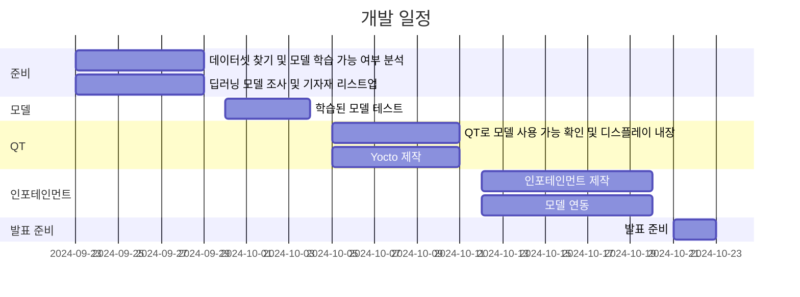

# 객체 인식 모델을 이용한 수신호 인식 모델 학습 및 인포테인먼트 제작

## 프로젝트 개요
이 프로젝트는 AI를 활용하여 수신호 인식 모델을 만들어 차량 고장, 교통 통제 때 사고 발생율을 줄이기 위해 제작된 프로젝트입니다.

## 개발 일정 (Gantt 차트)

## 개발 환경
- Ubuntu Linux
- Q.T
- VScode

## 프로젝트 팀원
- [서창민]
- [박준수]
- [김도하]

## 사용 기술
- AI/딥러닝
- Python 3.12
- YoloV8
- Yocto
