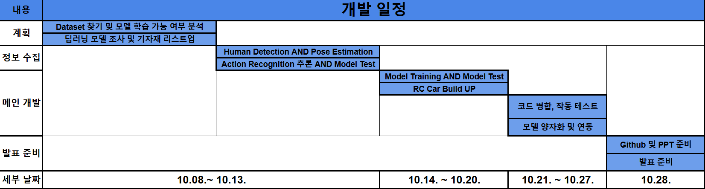
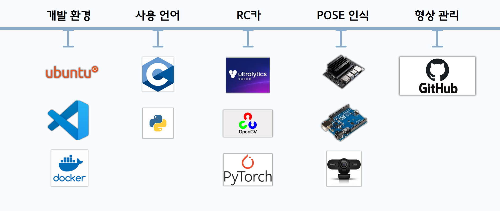
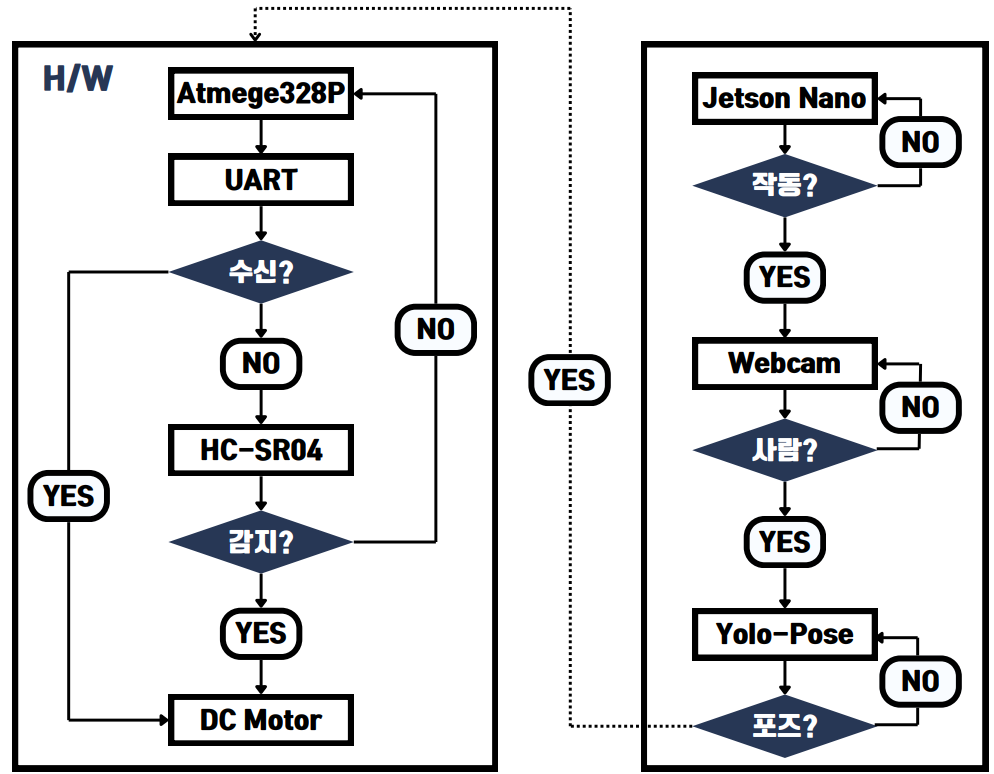
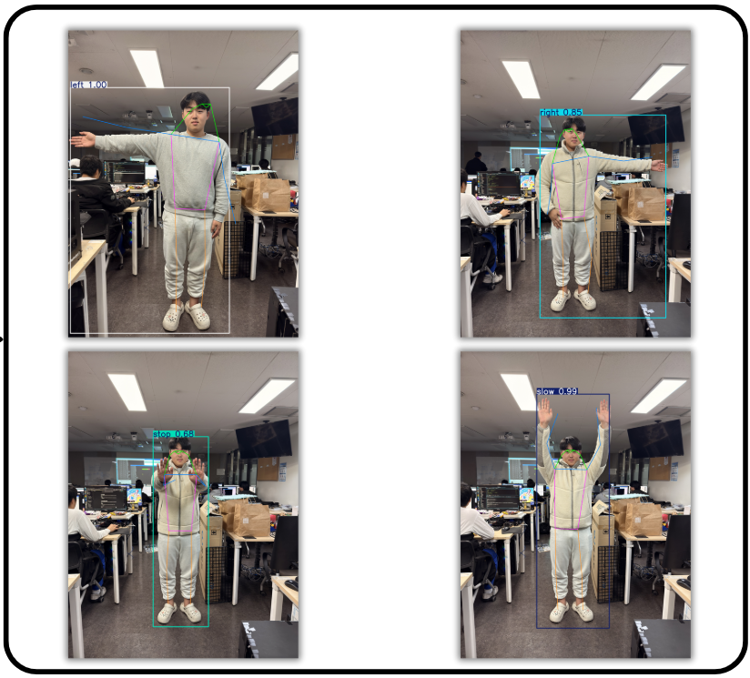
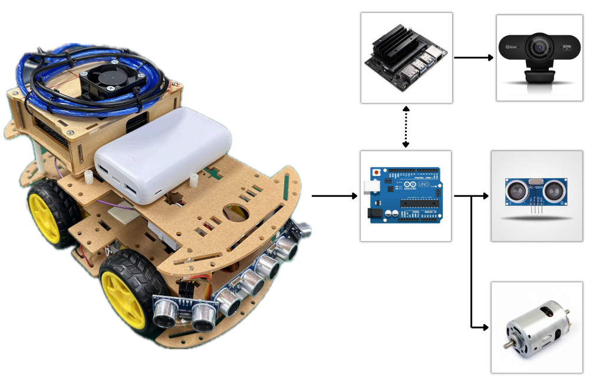

# Signal Masters 프로젝트

## **프로젝트 개요**
**Signal Masters**는 교통 수신호를 인식하여 RC카를 제어하는 자율주행 시스템입니다.  
이 프로젝트는 **YOLO-Pose**를 활용하여 수신호를 정확히 감지하고, 인식된 신호에 따라 RC카를 제어하여 도로 상황에서 발생할 수 있는 사고를 방지하는 데 목적을 둡니다.  

### 문제 인식
교통 신호를 수동으로 제어하는 작업은 특히 고장 난 차량을 도로에서 정리하는 과정에서 많은 위험이 따릅니다.  
**수신호를 진행하던 작업자가 사고를 당하는 빈번한 상황**을 예방하기 위해, Signal Masters는 신호를 자동화하여 **더 안전하고 신속하게 도로 상황을 관리**할 수 있는 시스템을 개발하고자 했습니다.

## **주요 목표**

1. **자율주행 RC카 구현**:
   - RC카가 **초음파 센서를 통해 장애물을 감지**하고 이를 회피하며 안전하게 이동.
   - Jetson Nano와의 실시간 통신을 통해 신호를 수신하고 이에 따른 제어 명령을 수행.

2. **교통 수신호 인식**:
   - **YOLO-Pose 기반의 포즈 인식 모델**을 활용하여 사람이 수행하는 수신호를 정확히 감지.
   - "Go", "Left", "Right", "Stop", "Slow"의 5가지 주요 신호를 인식하고 이에 따라 RC카의 동작을 결정.

3. **엣지 디바이스 최적화**:
   - Jetson Nano에서 YOLO 모델을 실행하며 **TensorRT를 사용한 양자화(FP16)**를 통해 모델 추론 속도를 최적화.
   - 엣지 디바이스 환경에서도 효율적인 동작을 보장.

## **팀 구성 및 역할**
| 팀원       | 역할                                                |
|------------|---------------------------------------------------|
| **서창민** | 프로젝트 총괄, 하드웨어 설계 및 개발, Dataset 라벨링    |
| **박준수** | AI 모델 설계 및 최적화, 소프트웨어 개발, Jetson Nano 통합 |
| **김도하** | Dataset 구축                  |

## **개발 일정**

- **Week 1 (데이터 준비)**:
  - YOLO-Pose 모델에 사용할 교통 신호 데이터를 수집하고 라벨링 작업 수행.
  - RC카의 기본 하드웨어 구조 설계.
  
- **Week 2 (모델 및 하드웨어 테스트)**:
  - YOLO-Pose 모델 훈련 및 Jetson Nano에서의 초기 테스트.
  - RC카의 기본적인 장애물 감지 및 제어 알고리즘 구현.

- **Week 3 (시스템 통합)**:
  - Jetson Nano와 RC카를 통합하여 포즈 인식 결과에 따른 제어 명령 테스트.
  - UART 통신 및 초음파 센서 데이터 활용.

- **Week 4 (최적화 및 테스트)**:
  - 모델 추론 속도 및 RC카 동작 최적화.
  - 실제 시나리오를 기반으로 종합 테스트 진행.

## **개발 환경**

### 소프트웨어
- **운영 체제**: Ubuntu 18.04 (Jetson Nano), Ubuntu 24.04 (개발 환경)
- **프로그래밍 언어**: Python (모델 추론 및 통신), C (RC카 제어)
- **사용 도구**:
  - **YOLOv11**: 포즈 인식 모델 훈련 및 추론.
  - **TensorRT**: 모델 양자화를 통해 추론 속도 최적화.
  - **AVR**: Atmega328P 기반 RC카 제어.

### 하드웨어
- **Jetson Nano**: 포즈 인식 및 제어 명령 송수신.
- **Atmega328P**: RC카의 모터 및 센서 제어.
- **HC-SR04**: 초음파 센서를 활용한 장애물 감지.
- **L298N**: DC 모터 제어용 드라이버.

## **시스템 구성**
### 통합 아키텍쳐

### 1. H/W 아키텍처
Signal Masters의 하드웨어는 RC카와 Jetson Nano, 그리고 각종 센서 및 모터 드라이버로 구성됩니다.

- **센서 및 모터 제어**:
  - HC-SR04 초음파 센서를 사용해 주변 장애물을 감지.
  - L298N 모터 드라이버로 DC 모터 4개를 제어하며 방향 및 속도를 조절.

- **Jetson Nano**:
  - YOLO-Pose 모델로 포즈 인식을 수행하고, 결과 데이터를 RC카에 전달.
  - Atmega328P와 UART를 통해 제어 신호 송신.

### 2. S/W 아키텍처

#### 모델 추론 파이프라인
1. YOLO-Pose를 사용하여 입력 영상에서 사람의 포즈를 실시간으로 추정.
2. 추정된 포즈 데이터를 분석하여 "Go", "Stop", "Left", "Right", "Slow" 신호를 인식.
3. 결과를 RC카로 전달하여 해당 신호에 맞는 동작 수행.

#### 제어 흐름
- **포즈 인식 결과에 따른 동작**:
  - `Stop`: RC카 정지.
  - `Go`: RC카 전진.
  - `Left`/`Right`: RC카 좌/우 회전.
  - `Slow`: RC카 저속 전진.

## **FlowChart**

시스템 전체 동작을 나타낸 FlowChart입니다.  
포즈 인식, 데이터 송신, 장애물 감지, RC카 제어의 흐름을 한눈에 확인할 수 있습니다.

## **주요 기능**

### 1. 포즈 인식
Signal Masters는 YOLO-Pose 모델을 사용하여 다음과 같은 교통 수신호를 정확히 인식합니다:
- **Go**: 전진 신호
- **Stop**: 정지 신호
- **Left**: 좌회전 신호
- **Right**: 우회전 신호
- **Slow**: 저속 전진 신호

추출된 포즈 데이터는 Serial 통신을 통해 RC카로 전달됩니다.

#### 4가지 포즈 데이터

-

### 2. RC카 제어
- **포즈 인식 결과 기반 제어**:
  - 인식된 신호에 따라 RC카의 속도와 방향을 제어.
- **장애물 감지**:
  - 초음파 센서를 사용하여 장애물을 탐지하고 회피 알고리즘 적용.

#### RC카 구성도

## **추가 설명**

### 문제점 및 해결 방안
1. **Jetson Nano에서 모델 추론 지연**:
   - 모델의 실행 속도 최적화가 필요.
   - **TensorRT를 활용해 FP16 양자화**를 통해 추론 속도를 대폭 향상.

2. **초음파 센서 간섭**:
   - 복수의 초음파 센서에서 동일 방향의 장애물 간섭 발생.
   - 초음파 센서 추가 장착하여 우선순위 탐지 최적화.

## **소스 코드**
### [소스 코드 바로가기](/src/)

## **발표 자료**
### [발표 자료 바로가기](/presentation/Project_Signal%20Masters.pdf)

## 시연 영상

### [초음파 자율주행](https://drive.google.com/file/d/1LynHMcAe_OcXiIWh1sUs9sHc4SFS0w5k/view?usp=sharing)

### [stop](https://drive.google.com/file/d/1oyC-Y7j-MBj6KcED1z0zxYbD8rTYaeVG/view?usp=sharing)

### [slow](https://drive.google.com/file/d/1LGg1vh6VOTCH6Y1CJtnxA6oF1tWf-Eti/view?usp=sharing)

### [left](https://drive.google.com/file/d/1ITP0SwLXomaiNytANyIgitCj2o7hwRe2/view?usp=sharing)

### [right](https://drive.google.com/file/d/1uQk3BmONCKeq9H47o0xfgPW1O86qV4sX/view?usp=sharing)
