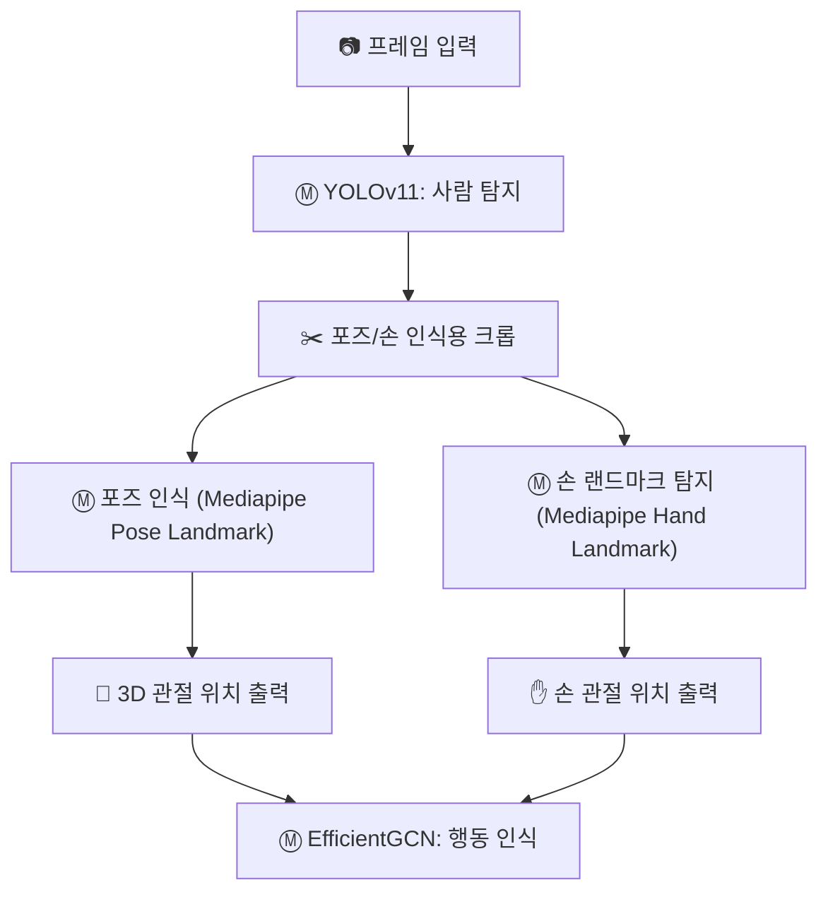

# 교통 수신호 인식 파이프라인

## 파이프라인 개요

## 모델 선택 이유

- **YOLOv11 (사람 탐지)**: **사람**을 정확하게 탐지하고, 이를 기반으로 후속 처리를 위한 영역 지정에 적합함.
- **Mediapipe Pose Landmark (포즈 인식)**: 3D 관절 위치를 추출하여 **수신호 제스처**의 주요 관절을 인식하고, **실시간 처리 성능**을 유지하면서 충분한 깊이 추정 가능.
- **Mediapipe Hand Landmark (손 랜드마크 인식)**: 손 동작을 정확하게 추적하며, 수신호 제스처에서 중요한 손의 움직임을 감지하는 데 필수적임.
- **EfficientGCN (행동 인식)**: **복잡한 수신호 제스처**와 같은 행동 인식에 최적화되어 있으며, 포즈와 손 관절 데이터를 바탕으로 **정확한 행동 인식** 수행.
  - EfficientGCN은 MS-G3D 대비 **더 효율적**이며, **실시간** 환경에서 적합한 성능을 제공함.

## 추가 정보

### 성능 비교
- **EfficientGCN**과 **MS-G3D**, **ST-GCN**의 성능 비교는 다음과 같음:
    - **EfficientGCN**: 높은 효율성 제공 (20-30 FPS, mAP 84%-87%)
    - **MS-G3D**: 높은 정확도를 제공하지만 더 많은 자원 소모 (8-15 FPS, mAP 87%-90%)
    - **ST-GCN**: 기본적인 동작 인식에는 적합하나, 복잡한 제스처 인식에는 한계가 있음 (10-15 FPS, mAP 81%-85%)

### 참조 논문
- [MS-G3D 논문](https://ar5iv.labs.arxiv.org/html/2106.15125)
- [EfficientGCN 논문](https://deepai.org/publication/constructing-stronger-and-faster-baselines-for-skeleton-based-action-recognition)
